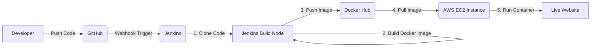

# System Architecture Overview

This document describes the end-to-end CI/CD (Continuous Integration / Continuous Deployment) flow for the **DevOps Pipeline Explorer** project.

## 🏗️ Architecture Diagram (Logic Flow)

## 🔄 The Full Flow Explained

### 1. GitHub (Source Control)
Everything starts when a developer pushes code to the `main` branch. GitHub serves as our **Single Source of Truth**. The project uses a branch-based workflow where code must be reviewed via **Pull Requests** before merging into `main`.

### 2. Jenkins (Automation Server)
Once code is merged into `main`, a trigger (Webhook or Polling) notifies our **Jenkins** server hosted on AWS. Jenkins then executes the steps defined in our `Jenkinsfile`:

*   **Clone Stage:** Jenkins downloads the latest source code from the repository.
*   **Build Stage:** Jenkins uses the `Dockerfile` to package our static website into a lightweight Docker image.
*   **Push Stage:** Jenkins authenticates with **Docker Hub** and uploads the newly built image with a specific tag.

### 3. Docker Hub (Registry)
Docker Hub acts as our **Container Registry**. It stores our versioned images (`sanjeevrk4145/student-app`). This makes our software "portable"—it can be downloaded and run on any machine that supports Docker.

### 4. AWS EC2 (Deployment)
In the final stage of the pipeline, Jenkins securely connects to our **AWS EC2 instance** via SSH. It executes the following commands:
1.  **Pull:** Downloads the latest image from Docker Hub.
2.  **Stop & Remove:** Cleans up any existing containers running on the target port.
3.  **Run:** Starts a new container, making the updated website live instantly on the public IP.

---

## 🛠️ Summary of Pipeline Stages

| Stage | Tool | Action |
| :--- | :--- | :--- |
| **Commit** | Git / GitHub | Code is pushed and merged into `main`. |
| **Trigger** | Webhook | Jenkins is notified of the change. |
| **CI** | Jenkins / Docker | Image is built and verified. |
| **Registry** | Docker Hub | Image is stored for distribution. |
| **CD** | Jenkins / AWS | SSH deployment to the production server. |
